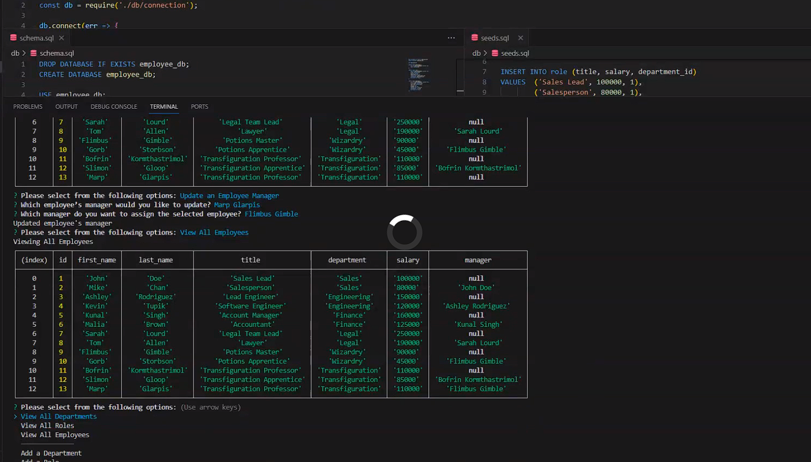

# 12 SQL: Employee Tracker

## The Task
Developers frequently have to create interfaces that allow non-developers to easily view and interact with information stored in databases. These interfaces are called **content management systems (CMS)**. This week's assignment was to build a command-line application from scratch to manage a company's employee database, using Node.js, Inquirer, and MySQL.

Because this application won’t be deployed, you’ll also need to create a walkthrough video that demonstrates its functionality and all of the following acceptance criteria being met. You’ll need to submit a link to the video and add it to the README of your project.

## Table of Contents (Optional)

If your README is long, add a table of contents to make it easy for users to find what they need.

- [User Story](#user-story)
- [Acceptance Criteria](#acceptance-criteria)
- [Tutorial Video](#tutorial-video)
- [Database Layout](#database-layout)
- [Features](#features)
- [Installation](#installation)
- [Credits](#credits)
- [License](#license)
  
## User Story
```md
AS A business owner
I WANT to be able to view and manage the departments, roles, and employees in my company
SO THAT I can organize and plan my business
```

## Acceptance Criteria
```md
GIVEN a command-line application that accepts user input
WHEN I start the application
THEN I am presented with the following options: view all departments, view all roles, view all employees, add a department, add a role, add an employee, and update an employee role
WHEN I choose to view all departments
THEN I am presented with a formatted table showing department names and department ids
WHEN I choose to view all roles
THEN I am presented with the job title, role id, the department that role belongs to, and the salary for that role
WHEN I choose to view all employees
THEN I am presented with a formatted table showing employee data, including employee ids, first names, last names, job titles, departments, salaries, and managers that the employees report to
WHEN I choose to add a department
THEN I am prompted to enter the name of the department and that department is added to the database
WHEN I choose to add a role
THEN I am prompted to enter the name, salary, and department for the role and that role is added to the database
WHEN I choose to add an employee
THEN I am prompted to enter the employee’s first name, last name, role, and manager, and that employee is added to the database
WHEN I choose to update an employee role
THEN I am prompted to select an employee to update and their new role and this information is updated in the database 
```

## Tutorial Video
The following video shows the application being used from the command line:

[](https://watch.screencastify.com/v/Trh2EbqtXUcq7RbK2I6K)

If clicking the video above does not bring you to the video, you may copy this link ito your browser: https://watch.screencastify.com/v/Trh2EbqtXUcq7RbK2I6K

## Database Layout
This database schema is designed as shown in the following image:


As the image illustrates, the schema contains the following three tables:

* `department`

    * `id`: `INT PRIMARY KEY`

    * `name`: `VARCHAR(30)` to hold department name

* `role`

    * `id`: `INT PRIMARY KEY`

    * `title`: `VARCHAR(30)` to hold role title

    * `salary`: `DECIMAL` to hold role salary

    * `department_id`: `INT` to hold reference to department role belongs to

* `employee`

    * `id`: `INT PRIMARY KEY`

    * `first_name`: `VARCHAR(30)` to hold employee first name

    * `last_name`: `VARCHAR(30)` to hold employee last name

    * `role_id`: `INT` to hold reference to employee role

    * `manager_id`: `INT` to hold reference to another employee that is the manager of the current employee (`null` if the employee has no manager)

## Features
View All Departments, Roles, and Employees:
- Users can view department names and IDs.  
- Users can view job titles, role IDs, departments, and salaries for all roles.  
- Users can view employee data: IDs, first names, last names, job titles, departments, salaries, and managers (if applicable).

Add Department, Role, and Employee:  
- Users can add a new department by entering the department name.  
- Users can add a new role by entering the role name, salary, and selecting the department.  
- Users can add a new employee by providing their first name, last name, role, and manager information.

Update Employee's Role and Manager
- Users can update an employee's role by selecting the employee and specifying the new role.
- Users can update an employee's manager by selecting the employee and specifying either a new manager or none at all.

### Future Features / Potentional Development
- Sorting and viewing employees by manager or department
- Functionality to delete departments, roles, and employees
- Viewing the budget of each department based on combined employee salaries

## Installation
<Note: You must have already created a mySQL account to use these installation methods.>
To install the Employee Tracker, follow these steps:

1. Clone the repository to your local machine:
   ```bash
   git clone https://github.com/IvanDirigible/employee-tracker.git
2. Change to the project directory:
    ```bash  
    cd employee-tracker  
3. Install the required dependencies using npm:  
    ```bash
    npm i  
4. Launch mysql:  
    ```bash
    mysql -u root -p  
5. When prompted, enter your password  
6. Create a user and password to match the code  
    ```bash
    CREATE USER 'root'@'localhost' IDENTIFIED BY 'H@3rt2<3'; 
7. Give the user the same privileges as the root user  
    ```bash
    GRANT ALL PRIVILEGES ON * . * TO 'root'@'localhost';
8. To make the changes effective immediately  
    ```bash
    FLUSH PRIVILEGES;  
9. To create the database  
    ```bash
    source db/schema.sql;  
10. To seed the database  
    ```bash
    source db/seeds.sql;  
11. Switch to the database to check the data if needed
    ```bash
    USE employee_db;  
12. Check the employee table to confirm the seed data populated  
    ```bash
    SELECT * FROM employee;  
13. Exit mysql after confirming the seed data  
    ```bash
    exit;  

## Credits
Shout out to Chris for helping me with figuring out the spread operator, and with putting bash commands in this README file.

## License
This project is licensed under the MIT license.  
License Link  
https://opensource.org/licenses/MIT   
[]  
